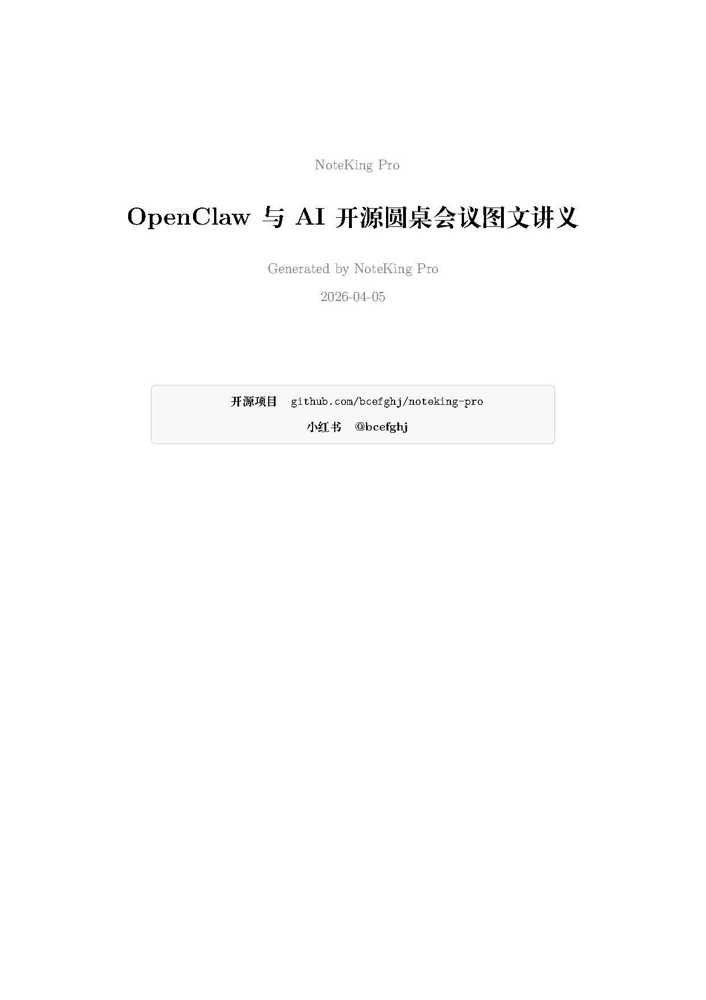
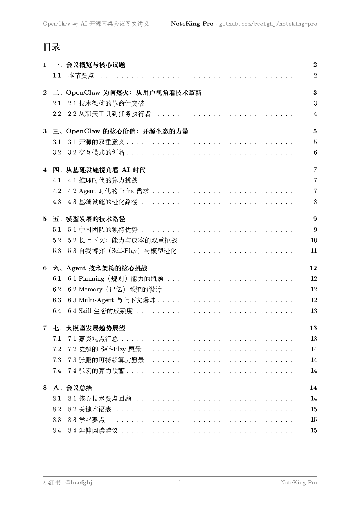
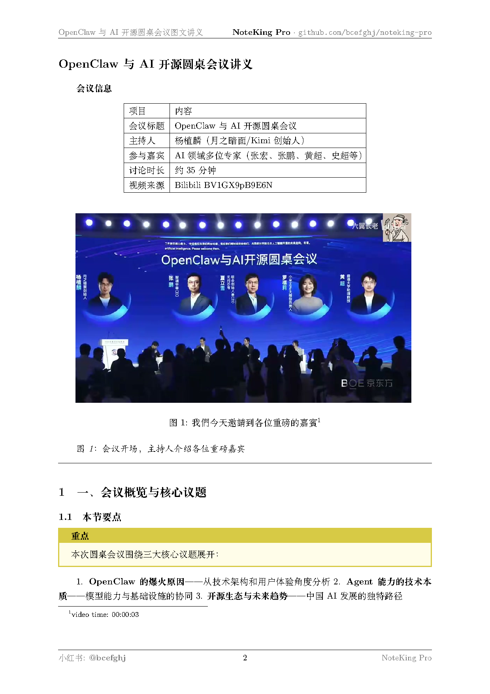
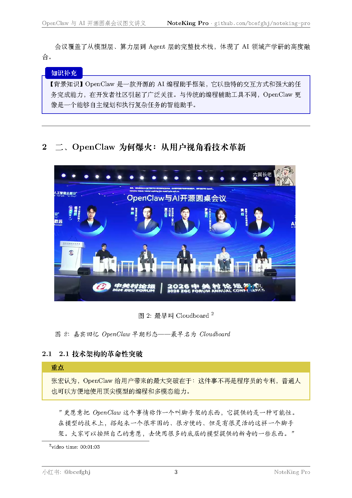
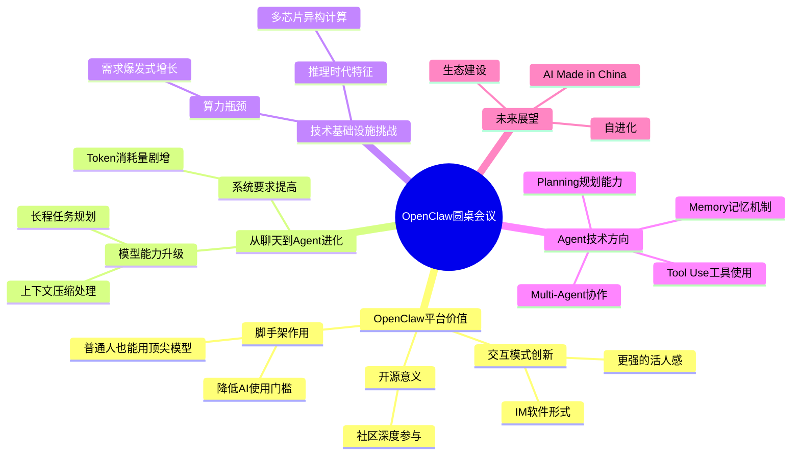

# 👑 NoteKing Pro — 全网最强视频/录音处理工具

一键把视频、录音、会议转化为精美图文 PDF 讲义、结构化会议纪要、思维导图、学习闪卡等多种格式。

**支持 30+ 平台视频 | 本地录音/视频上传 | 说话人分离 | 降噪增强 | 23 种输出模板 | 中英混合**

[](https://github.com/bcefghj/noteking-pro)
[](https://opensource.org/licenses/MIT)

> 🔗 **GitHub**: [github.com/bcefghj/noteking-pro](https://github.com/bcefghj/noteking-pro) · **小红书**: [@bcefghj](https://www.xiaohongshu.com/user/profile/bcefghj)

---

## 🔀 与 NoteKing（原版）的对比

> NoteKing Pro 是 [NoteKing](https://github.com/bcefghj/noteking) 的全功能升级版，在完整保留原版在线视频处理能力的基础上，新增了**本地录音/会议处理**能力。

| 功能 | [NoteKing（原版）](https://github.com/bcefghj/noteking) | NoteKing Pro（本仓库） |
|------|------|------|
| 在线视频转笔记（B站/YouTube 等） | ✅ | ✅ |
| LaTeX PDF 图文讲义 | ✅ | ✅ 升级版（含页眉页脚品牌） |
| **本地录音/视频处理** | ❌ | ✅ |
| **说话人分离（多人会议）** | ❌ | ✅ pyannote-audio |
| **降噪增强** | ❌ | ✅ 三级降噪 |
| **多文件合并** | ❌ | ✅ |
| 输出模板数量 | 13 种 | 23 种 |
| 典型案例 | MiniMind 课程（B站 26 集） | OpenClaw 圆桌会议（35 分钟） |

**如果你只需要处理在线视频 →** 可以用轻量级的 [NoteKing 原版](https://github.com/bcefghj/noteking)

---

## 🎬 真实案例：35分钟会议视频 → 10种输出文档

> 以下全部为 NoteKing Pro **自动生成**的真实结果，源文件在 [`demos/openclaw_meeting/`](demos/openclaw_meeting/)
>
> 原始视频：[OpenClaw与AI开源圆桌会议 · 杨植麟（月之暗面）主持](https://www.bilibili.com/video/BV1GX9pB9E6N/) — Bilibili · 35分钟

### 📄 核心功能：LaTeX PDF 精美图文讲义

**16页图文并茂的专业讲义，含12张自动提取的视频关键帧，XeLaTeX 专业排版：**

| 预览页 | 预览页 |
|--------|--------|
|  |  |
| *封面：标题、日期、GitHub/小红书信息* | *目录页：自动生成章节导航* |
|  |  |
| *正文：关键帧截图 + 重点框 + 结构化文字* | *正文：表格对比 + 引用 + 知识补充框* |

📥 **[下载完整 PDF（1.5MB，16页）](demos/openclaw_meeting/OpenClaw圆桌会议_图文讲义.pdf)**

**PDF 每页包含：**
- 🖼️ 视频关键帧截图（智能评分提取，插入对应知识点旁）
- 🟡 重点提示框 / 🔵 知识补充框 / 🔴 注意事项框
- 页眉：文章标题 + `github.com/bcefghj/noteking-pro`
- 页脚：小红书 `@bcefghj` + 页码 + NoteKing Pro

---

### 📋 会议纪要（结构化 Markdown）

> 完整文件：[demos/openclaw_meeting/会议纪要.md](demos/openclaw_meeting/会议纪要.md)

<details>
<summary>📖 展开查看（节选）</summary>

```
# OpenClaw与AI开源圆桌会议纪要

## 一、会议基本信息
| 项目 | 内容 |
|------|------|
| 主持人 | 杨植麟（月之暗面/Kimi创始人）|
| 参会人员 | 张宏、张鹏（智谱）、利算科技代表、小米代表、黄超（Nanobot）等 |
| 讨论主题 | OpenClaw平台与AI开源生态讨论 |

## 二、主要议题
1. OpenClaw使用体验与价值探讨
2. OpenClaw与Agent框架的革命性意义
3. 智谱 Grok5 Turbo 模型发布
4. 推理时代的基础设施挑战
5. Agent技术发展方向（Planning / Memory / Tool Use）
6. 未来12个月展望

## 三、行动项
- [ ] 探索 Agent 自进化能力落地路径
- [ ] 打造面向 Agent 原生的基础设施生态
- [ ] 推动 MCP 协议标准化与 Skill 质量提升
```

</details>

---

### 📊 简报摘要（3分钟速读版）

> 完整文件：[demos/openclaw_meeting/简报摘要.md](demos/openclaw_meeting/简报摘要.md)

**TL;DR**：OpenClaw 引领 AI Agent 开源生态爆发，业界共识从"聊天工具"转向"干活助手"，但推理算力瓶颈与模型自主进化能力成为下一阶段核心挑战。

**核心要点：**
1. **OpenClaw 重新定义 AI 交互范式** — 从"聊天"升级为"干活"，IM 软件嵌入方式带来"活人感"
2. **推理算力需求指数爆发** — Token 用量每两周翻倍，已增长 10 倍
3. **Agent 框架推动模型能力两极分化** — 开源框架将国内模型"下限"提升至接近顶级模型
4. **长上下文与自主进化成竞争焦点** — 72步长程规划、上下文压缩是关键
5. **生态共建与商业可持续是长期命题** — 需回归合理商业价值

---

### 💬 核心金句提炼

> 完整文件：[demos/openclaw_meeting/核心金句与观点.md](demos/openclaw_meeting/核心金句与观点.md)

> **"普通人也可以比较方便的来使用顶尖的这些模型的能力。"** — 张宏

> **"模型从最开始在按照Token去聊天，到现在能够变成一个Agent，变成一个龙虾，能够帮你去完成任务——它对于我们整个AI的想象力空间已经做了一个很大的提升。"**

> **"未来可能大部分的软件都不一定会面向人了……可能面向Agent的原生的去使用的。"** — 黄超

> **"我们想做的就是 AI Made in China——把我们中国的这些能源上的优势，通过这些推理工厂，可持续的再输出到全球。"**

---

### 🗺️ 思维导图（Mermaid，GitHub 直接渲染）

> 完整文件：[demos/openclaw_meeting/思维导图.md](demos/openclaw_meeting/思维导图.md)



---

### 🃏 学习闪卡（Q&A 格式）

> 完整文件：[demos/openclaw_meeting/学习闪卡.md](demos/openclaw_meeting/学习闪卡.md)

**Q: OpenClaw 是什么？它在 AI 生态中的定位？**
> A: OpenClaw 是一个开源 Agent 框架，提供"脚手架"让普通人便捷使用顶尖大模型能力，将 AI 从程序员专利变成大众工具。

**Q: 为什么 OpenClaw 会在社区爆火？**
> A: ① IM 软件交互方式带来"活人感"；② 证明了简单 Agent loop 的可行性；③ 开源激发了社区创新活力。

**Q: AI 开源生态目前面临哪些主要挑战？**
> A: Token 用量爆发（每两周翻倍）、算力资源整合、基础设施适配 Agent 时代需求。

---

### 🎤 SRT 字幕文件（1405 条）

> 完整文件：[demos/openclaw_meeting/meeting.srt](demos/openclaw_meeting/meeting.srt)

```srt
1
00:00:00,000 --> 00:00:03,720
我們今天邀請到各位重磅的嘉賓

2
00:00:03,720 --> 00:00:07,160
然後也覆蓋了其實不同的層面

3
00:00:07,160 --> 00:00:10,320
從模型層到底層的算力層到上面的Agent層
```

---

### 📊 处理统计

| 项目 | 数值 |
|------|------|
| 视频时长 | 35.7 分钟 |
| ASR 引擎 | faster-whisper (base) |
| 字幕条数 | 1,405 条 |
| 转录字数 | 12,430 字符 |
| LLM | MiniMax M2.7 (200K context) |
| PDF 页数 | 16 页 |
| PDF 大小 | 1.5 MB |
| 关键帧 | 12 张（智能评分提取） |
| 输出文件 | 10 个 |
| 总处理时间 | ~10 分钟 |

---

## ✨ 核心亮点

| 功能 | 说明 |
|------|------|
| 🌐 **30+ 平台** | B站、YouTube、抖音、小红书、TikTok 等 1800+ 站点 |
| 🎙️ **本地录音/视频** | 直接上传 MP4/MP3/WAV 等文件处理 |
| 🗣️ **说话人分离** | 自动识别多人对话，标注谁说了什么 (pyannote-audio) |
| 🔇 **降噪增强** | 三级降噪，嘈杂环境也能清晰转录 |
| 📄 **LaTeX PDF 讲义** | ctex + tcolorbox + xelatex 专业排版 |
| 📋 **23 种模板** | 会议纪要、课堂笔记、访谈、闪卡、思维导图等 |
| 🌍 **多语言** | 中文最强 (FunASR WER 8.4%)、英文、50+ 语言 |
| 📦 **多文件合并** | 连续录制的多段文件自动拼接 |
| 🔌 **全形态部署** | CLI / Web / MCP Server / OpenClaw Skill / 桌面端 |
| 🆓 **开源免费** | 本地 ASR 免费，只有 LLM 按需付费 |

---

## 🚀 快速开始

### 安装

```bash
# 克隆仓库
git clone https://github.com/bcefghj/noteking-pro.git
cd noteking-pro

# 安装 (基础)
pip install -e .

# 安装 (带录音处理)
pip install -e ".[meeting,asr]"

# 安装 (全部功能)
pip install -e ".[all]"

# 首次配置
noteking setup --api-key "你的API_KEY" --base-url "https://api.minimax.chat/v1" --model "MiniMax-M2.7"
```

**前置依赖**: Python 3.11+, FFmpeg (`brew install ffmpeg` / `apt install ffmpeg`)

### 处理在线视频

```bash
# B站视频 -> 详细学习笔记
noteking run "https://www.bilibili.com/video/BV1xx" -t detailed

# YouTube -> 思维导图
noteking run "https://youtu.be/xxx" -t mindmap

# 本地视频 -> LaTeX PDF
noteking run "./lecture.mp4" -t latex_pdf
```

### 处理本地录音/会议 (NEW)

```bash
# 会议录音 -> 会议纪要（带说话人分离）
noteking process meeting.mp4 -t meeting_minutes -c "产品周会" --speakers 4

# 课堂录音 -> 课堂笔记（降噪处理）
noteking process lecture.mp3 -t lecture_notes --denoise 2

# 多段录音合并处理
noteking process part1.mp4 part2.mp4 -t meeting_minutes

# 访谈 -> 多格式输出
noteking process interview.wav -t interview --format markdown,srt,json

# 仅转录
noteking transcribe recording.mp4

# 仅降噪
noteking denoise noisy.wav --level 2

# 合并文件
noteking merge seg1.mp4 seg2.mp4 -o merged.mp4
```

---

## 📋 23 种输出模板

### 视频模板
| 模板 | 名称 | 适用场景 |
|------|------|---------|
| `brief` | 简要总结 | 快速概览 |
| `detailed` | 详细学习笔记 | 系统学习 |
| `mindmap` | 思维导图 | 知识结构 |
| `flashcard` | 闪卡 (Anki) | 间隔重复 |
| `quiz` | 测验题 | 自测 |
| `timeline` | 时间线笔记 | 带时间戳 |
| `exam` | 考试复习 | 备考 |
| `tutorial` | 教程步骤 | 操作指南 |
| `news` | 新闻速览 | 快讯 |
| `podcast` | 播客摘要 | 对话 |
| `xhs_note` | 小红书笔记 | 社交分享 |
| `latex_pdf` | LaTeX PDF | 专业讲义 |
| `custom` | 自定义 | 自由定义 |

### 录音/会议模板 (NEW)
| 模板 | 名称 | 适用场景 |
|------|------|---------|
| `meeting_minutes` | 会议纪要 | 会议记录，含行动项 |
| `lecture_notes` | 课堂笔记 | 知识点/公式/习题 |
| `interview` | 访谈记录 | Q&A/观点/立场 |
| `brainstorm` | 灵感记录 | 想法/思维导图 |
| `news_digest` | 新闻摘要 | 5W1H 结构 |
| `exam_prep` | 考试复习 | 闪卡+模拟题 |
| `cornell_notes` | 康奈尔笔记 | 经典学习法 |
| `podcast_shownotes` | 播客节目笔记 | 章节+要点 |
| `entertainment` | 娱乐内容 | 高光/金句 |
| `smart_summary` | 智能摘要 | 自适应长度 |

---

## 🏗️ 技术架构

```
输入 → 预处理 → ASR转录 → 说话人分离 → LLM生成 → 多格式输出

输入层:
├── 在线视频 (30+ 平台, yt-dlp)
├── 本地视频 (MP4/MKV/AVI/MOV)
├── 本地录音 (MP3/WAV/FLAC/M4A)
└── 多文件合并 (FFmpeg concat)

预处理:
├── 音频提取 (FFmpeg 16kHz mono WAV)
├── 降噪增强 (noisereduce / DeepFilterNet)
└── VAD 分片 (超长音频切分)

ASR 引擎 (自动选择最佳):
├── FunASR Paraformer-zh (中文最强, WER 8.4%)
├── faster-whisper (英文/多语言)
├── SenseVoice (50+ 语言)
└── Groq/OpenAI API (云端回退)

说话人分离:
├── pyannote-audio 3.x
└── WhisperX 风格对齐

输出:
├── Markdown / LaTeX PDF / SRT / VTT
├── 思维导图 / 闪卡 / JSON
└── 带说话人标签的完整转录
```

---

## 🌐 多形态部署

### Web 网站
```bash
# Docker 一键部署
docker compose up -d
# 访问 http://localhost:8000
```

### CLI 命令行
```bash
pip install -e ".[meeting]"
noteking process meeting.mp4 -t meeting_minutes
```

### MCP Server (Cursor / Claude Desktop / OpenClaw)
```json
{
  "mcpServers": {
    "noteking": {
      "command": "npx",
      "args": ["tsx", "mcp/src/index.ts"],
      "env": { "NOTEKING_DIR": "/path/to/noteking" }
    }
  }
}
```

### OpenClaw Skill
已发布到 ClawHub，直接安装使用。

### API
```bash
# 启动 API 服务
uvicorn api.main:app --host 0.0.0.0 --port 8000

# 处理视频
curl -X POST http://localhost:8000/api/v1/summarize \
  -H "Content-Type: application/json" \
  -d '{"url": "https://www.bilibili.com/video/BV1xx", "template": "detailed"}'

# 上传录音处理
curl -X POST http://localhost:8000/api/v1/recording/upload -F "file=@meeting.mp4"
curl -X POST http://localhost:8000/api/v1/recording/process \
  -F "file_id=xxx" -F "template=meeting_minutes" -F "context=产品周会"
```

---

## 📖 部署教程

详见 [docs/deploy-guide.md](docs/deploy-guide.md)

- **方案 A**: Railway 一键部署（免费，最简单）
- **方案 B**: Docker + 云服务器（推荐正式运营）
- **方案 C**: 带 GPU 部署（最佳 ASR 质量）
- **个人本地**: pip install 即用

---

## 🔧 环境变量

| 变量 | 必填 | 说明 |
|------|------|------|
| `NOTEKING_LLM_API_KEY` | 是 | LLM API Key (MiniMax/OpenAI/DeepSeek) |
| `NOTEKING_LLM_BASE_URL` | 否 | 自定义 API 地址 |
| `NOTEKING_LLM_MODEL` | 否 | 模型名称 (默认 gpt-4o-mini) |
| `HF_TOKEN` | 否 | HuggingFace Token (pyannote 说话人分离) |
| `NOTEKING_PROXY` | 否 | 代理 (YouTube 访问) |
| `BILIBILI_SESSDATA` | 否 | B站登录 Cookie |

---

## 📄 License

MIT License - 开源免费，随意使用

---

## 🙏 致谢

核心技术栈: OpenAI Whisper, FunASR, pyannote-audio, faster-whisper, FFmpeg, yt-dlp, OpenAI SDK

灵感来源: 钉钉AI听记, Otter.ai, NotebookLM, Meetily, Open Notebook, BibiGPT

---

## 📣 关注我们

| 平台 | 链接 |
|------|------|
| 🔗 GitHub（Pro） | [github.com/bcefghj/noteking-pro](https://github.com/bcefghj/noteking-pro) |
| 🔗 GitHub（原版） | [github.com/bcefghj/noteking](https://github.com/bcefghj/noteking) |
| 📕 小红书 | [@bcefghj](https://www.xiaohongshu.com/user/profile/bcefghj) |

> 觉得好用请给个 ⭐ Star，让更多人发现这个工具！
