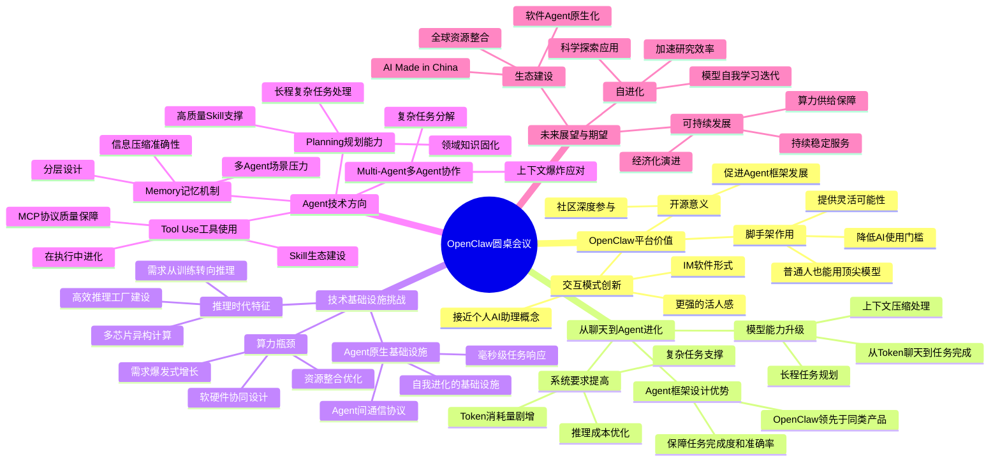

# OpenClaw圆桌会议思维导图


```mermaid
mindmap
    root((OpenClaw圆桌会议))
        OpenClaw平台价值
            脚手架作用
                降低AI使用门槛
                普通人也能用顶尖模型
                提供灵活可能性
            交互模式创新
                IM软件形式
                更强的活人感
                接近个人AI助理概念
            开源意义
                社区深度参与
                促进Agent框架发展
        从聊天到Agent进化
            模型能力升级
                从Token聊天到任务完成
                长程任务规划
                上下文压缩处理
            系统要求提高
                Token消耗量剧增
                推理成本优化
                复杂任务支撑
            Agent框架设计优势
                OpenClaw领先于同类产品
                保障任务完成度和准确率
        技术基础设施挑战
            算力瓶颈
                需求爆发式增长
                资源整合优化
                软硬件协同设计
            推理时代特征
                需求从训练转向推理
                多芯片异构计算
                高效推理工厂建设
            Agent原生基础设施
                毫秒级任务响应
                Agent间通信协议
                自我进化的基础设施
        Agent技术方向
            Planning规划能力
                长程复杂任务处理
                领域知识固化
                高质量Skill支撑
            Memory记忆机制
                信息压缩准确性
                分层设计
                多Agent场景压力
            Tool Use工具使用
                MCP协议质量保障
                Skill生态建设
                在执行中进化
            Multi-Agent多Agent协作
                复杂任务分解
                上下文爆炸应对
        未来展望与期望
            自进化
                模型自我学习迭代
                科学探索应用
                加速研究效率
            生态建设
                软件Agent原生化
                全球资源整合
                AI Made in China
            可持续发展
                算力供给保障
                持续稳定服务
                经济化演进
```
```